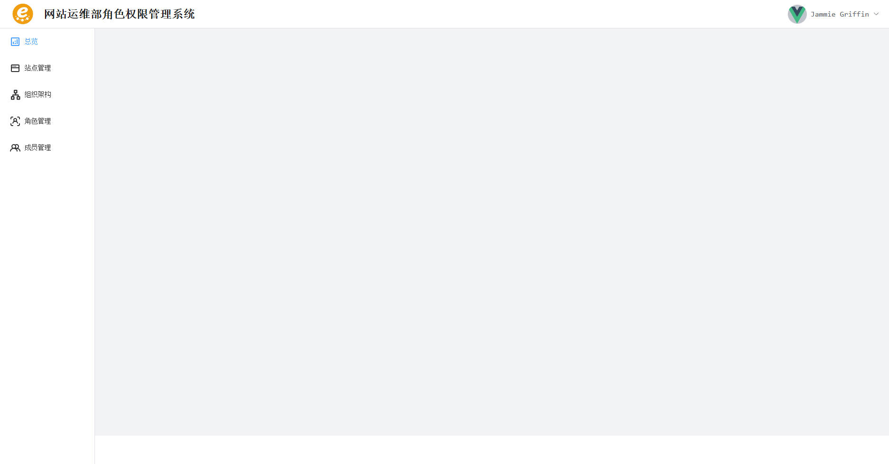

## 在项目中使用 element plus

安装自动导入插件

```bash
pnpm add -D unplugin-vue-components unplugin-auto-import
```

在 `vite.config.ts` 中添加所下载的插件

```ts
// vite.config.ts
// ...
import AutoImport from 'unplugin-auto-import/vite'
import Components from 'unplugin-vue-components/vite'
import { ElementPlusResolver } from 'unplugin-vue-components/resolvers'
export default defineConfig({
  plugins: [
    // ...
    AutoImport({
      resolvers: [ElementPlusResolver()]
    }),
    Components({
      resolvers: [ElementPlusResolver()]
    })
  ]
})
```

## 设置全局样式

在 `src/assets/` 目录下新建一个 scss 目录用于存放 scss 样式  
新建一个 `global.scss` 文件用于定义全局样式

```scss
// src/assets/scss/global.scss
* {
  margin: 0;
  padding: 0;
  font-family: ui-monospace, SFMono-Regular, Menlo, Monaco, Consolas, 'Liberation Mono',
    'Courier New', monospace;
}
```

在 `main.ts` 中引入全局样式

```ts
// main.ts
import './assets/scss/global.scss'
```

## 配置路由

目前规划了五个页面：

- 总览 Home.vue
- 站点管理 Website.vue
- 组织架构 Organization.vue
- 角色管理 Role.vue
- 成员管理 Member.vue

在 `views` 目录下创建上述 `.vue` 文件，并写入以下内容

```html
<script setup lang="ts"></script>
<template>
  <div></div>
</template>
<style scoped lang="scss"></style>
```

在 `router` 目录下新建 `index.ts` 文件，创建 vue-router 路由并导出

```ts
// src/router/index.ts
import { createRouter, createWebHistory, RouteRecordRaw } from 'vue-router'
const routes: RouteRecordRaw[] = [
  {
    path: '/',
    component: () => import('../views/Home.vue')
  },
  {
    path: '/webste',
    component: () => import('../views/Home.vue')
  },
  {
    path: '/organization',
    component: () => import('../views/Home.vue')
  },
  {
    path: '/role',
    component: () => import('../views/Home.vue')
  },
  {
    path: '/members',
    component: () => import('../views/Home.vue')
  }
]

const router = createRouter({
  routes,
  history: createWebHistory()
})

export default router
```

## 页面布局

使用 element plus 的 container 布局容器，采用 header、sider、main、footer 四栏布局，如下图所示：


实现代码：

```html
<template>
  <div class="h-screen ">
    <el-container class="h-full">
      <el-header class="border-b-1 border-b-solid border-b-[#dcdfe6]">
        <header />
      </el-header>
      <el-container class="h-full">
        <el-aside width="200px">
          <Sider />
        </el-aside>
        <el-container>
          <el-main class="bg-[#f2f3f5]">
            <main />
          </el-main>
          <el-footer>
            <footer />
          </el-footer>
        </el-container>
      </el-container>
    </el-container>
  </div>
</template>
```

其中：

- `<Header />` -> src/components/layout/Header.vue
- `<Main />` -> src/components/layout/Main.vue
- `<Footer />` -> src/components/layout/Header.vue
- `<Sider />` -> src/components/layout/Header.vue

## header 组件

header 部分左侧显示社团 logo 以及系统名称，右侧显示用户头像以及用户名称。用户名称是一个下拉菜单，效果如下所示：


实现代码：

```html
<script setup lang="ts">
  import logo from '../../assets/gcu-womd.png'
  import avatar from '../../assets/vue.svg'
</script>
<template>
  <div class="h-full flex justify-between items-center">
    <div class="flex gap-x-4 items-center">
      
      <h1>网站运维部角色权限管理系统</h1>
    </div>
    <div class="flex gap-x-2 items-center">
      <!-- 用户头像根据登录用户决定，目前没有对接后端先写死 -->
      <el-avatar :src="avatar" />
      <el-dropdown>
        <div class="flex gap-x-2 cursor-pointer focus-visible:outline-none">
          <!-- 用户名称，先写死 -->
          <el-text size="large">Jammie Griffin</el-text>
          <div class="i-ep:arrow-down"></div>
        </div>
        <template #dropdown>
          <el-dropdown-item>站点导航</el-dropdown-item>
        </template>
      </el-dropdown>
    </div>
  </div>
</template>
<style scoped lang="scss"></style>
```

## 侧边菜单栏

使用 el-menu 实现，开启 vue-router 模式，将 el-menu-item 的 index 属性设置为路由视图的 path 即可实现点击菜单项跳转对应页面

对于图标：使用 unocss 的 presetIcon 预设，在 div 标签中添加类名 `i-` + `图标名称` 即可显示图标，图标名称在 [iconify](https://icon-sets.iconify.design/) 上面找

实现代码：

```html
<div class="h-full">
  <el-menu class="h-full" :router="true" default-active="/">
    <el-menu-item index="/">
      <div class="i-material-symbols:analytics-outline text-2xl mr-2"></div>
      <span> 总览 </span>
    </el-menu-item>
  </el-menu>
</div>
```

## 布局实现效果


